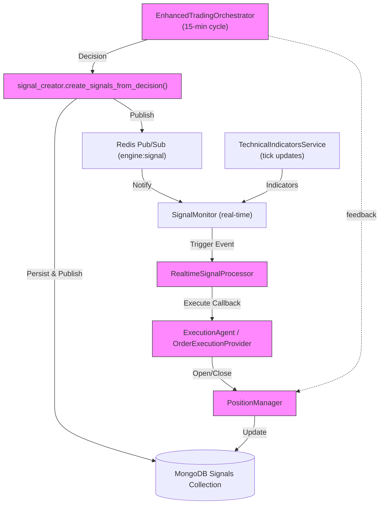

# Engine Module — Agents Reference

This document summarizes each agent in the `engine_module`, their expected inputs, outputs (AnalysisResult), side-effects, and who consumes their outputs. Use this as a quick reference when adding or modifying agents.

---

## Overview

- Agents implement `Agent.analyze(context) -> AnalysisResult`.
- Typical AnalysisResult: { decision: str, confidence: float, details: dict }
- Main orchestrator: `EnhancedTradingOrchestrator` (orchestrator runs agents each cycle, aggregates results).
- Signal creation: `signal_creator.create_signals_from_decision()` converts decisions -> conditional `TradingCondition`s and persists them to MongoDB + Redis pub/sub.
- Real-time flow: `TechnicalIndicatorsService` -> `SignalMonitor` -> triggers -> execution callback -> `ExecutionAgent` or `PositionManager`.

---

## Agents (alphabetical)

### TechnicalAgent 🔧
- Purpose: Compute core indicators (RSI, ATR, SMA) from raw OHLC and provide simple BUY/SELL/HOLD.
- Inputs: context['ohlc'] (list of OHLC dicts), optional 'current_price'.
- Outputs: AnalysisResult(decision, confidence, details={indicators, decision_basis}).
- Consumers: Orchestrator, PortfolioManager, other agents (e.g., MomentumAgent may take precomputed indicators).

### EnhancedTechnicalAgent 🔎 (consumes indicator service)
- Purpose: Interpret pre-calculated indicators (momentum/trend/volume/mean-reversion perspectives) and aggregate them with weighted voting.
- Inputs: context['indicators'] or fetches from TechnicalIndicatorsService if absent.
- Outputs: AnalysisResult(decision, confidence, details={perspectives, weighted_scores, reasoning}).
- Consumers: Orchestrator, PortfolioManager.

### MomentumAgent & EnhancedMomentumAgent ⚡
- MomentumAgent:
  - Purpose: RSI + volume-based momentum signals.
  - Inputs: context['technical_indicators'], 'current_price', optional position flags.
  - Outputs: AnalysisResult(decision=BUY/SELL/HOLD, confidence, details including entry_price, stop_loss, take_profit).
- EnhancedMomentumAgent (BaseAgent subclass):
  - Adds multi-timeframe, exit checks, structured reports, position recommendations.
- Consumers: Orchestrator, SignalCreator (to create conditional signals), PositionManager.

### TrendAgent 📈
- Purpose: MA crossovers + ADX trend following.
- Inputs: context['ohlc'] (sufficient length), optional positions.
- Outputs: AnalysisResult with entry/stop/target and reasoning.
- Consumers: Orchestrator, PortfolioManager.

### MeanReversionAgent 🔄
- Purpose: Bollinger Bands + RSI mean reversion signals.
- Inputs: context['ohlc'] (>= ~25 candles), optional 'current_price'.
- Outputs: AnalysisResult(decision, confidence, details with band metrics and levels).
- Consumers: Orchestrator, SignalCreator.

### VolumeAgent 📊
- Purpose: Detect volume spikes that confirm price moves.
- Inputs: context['ohlc'] with volumes, config thresholds.
- Outputs: AnalysisResult(decision, confidence, details including volume_ratio, entry/stop/take_profit).
- Consumers: Orchestrator, PortfolioManager.

### FundamentalAgent 🧾
- Purpose: Simple fundamental heuristics (earnings surprise / revenue growth).
- Inputs: context['earnings_surprise'], context['revenue_growth'].
- Outputs: BUY/SELL/HOLD with low-medium confidence.
- Consumers: ResearchManager, PortfolioManager.

### SentimentAgent 📰
- Purpose: Build sentiment bias from news/aggregate sentiment (optionally via LLM).
- Inputs: context['latest_news'], context['sentiment_score'].
- Outputs: AnalysisResult(decision, confidence, details with retail/institutional sentiment).
- Consumers: PortfolioManager, ResearchManager, OptionsAnalysis.

### MacroAgent 🌍
- Purpose: Analyze macro variables (rates, inflation) for bias (BUY/SELL/HOLD).
- Inputs: context['rbi_rate'], 'inflation_rate', 'instrument_name' etc.
- Outputs: decision + 'macro_regime', 'macro_bias'.
- Consumers: PortfolioManager, ResearchManager.

### BullResearcher / BearResearcher 🐂/🐻
- Purpose: Produce bullish / bearish thesis and suggest options strategies (e.g., BULL_CALL_SPREAD).
- Inputs: context (technical indicators, symbol, current_price).
- Outputs: Options-strategy-style decision (BULL_CALL_SPREAD / BEAR_PUT_SPREAD), thesis, confidence, stored memory experiences.
- Consumers: ResearchManager (or EnhancedResearchManager).

### ResearchManager / EnhancedResearchManager 🧠
- Purpose: Run bull vs bear analyses, conduct debate (simple or formal DebateProtocol), synthesize a final research decision (including options strategy suggestions like IRON_CONDOR).
- Inputs: Market/technical context, bull/bear outputs.
- Outputs: Synthesized decision (options strategy name or HOLD), confidence, research_plan.
- Consumers: Orchestrator (for options strategy execution), PortfolioManager.

### OptionsAnalysisAgent & OptionsStrategyAgent 🪙
- OptionsAnalysisAgent:
  - Purpose: Analyze calls/puts chain (OI, IV, PCR), recommend multi-leg strategies (Bull/Bear spreads, Iron Condor).
  - Inputs: 'calls', 'puts', 'underlying_price', 'pcr', 'max_pain', 'consensus_direction'.
  - Outputs: AnalysisResult(decision => strategy name, confidence, details with legs/net_debit/max_profit/max_loss).
- OptionsStrategyAgent:
  - Purpose: Build concrete OptionsStrategyDetails for selected strategy types (helper/authoritative builder).
  - Consumers: Orchestrator, SignalCreator (strategy details are added to signal metadata).

### PortfolioManagerAgent 🗳️
- Purpose: Aggregate agent outputs (technical, sentiment, macro) with simple voting into a final BUY/SELL/HOLD.
- Inputs: context with agent outputs (dicts containing bias fields or decisions).
- Outputs: decision + confidence + votes breakdown.
- Consumers: Orchestrator, OptionsAnalysis/Strategy selectors.

### RiskAgent family & EnhancedRiskAgent 🛡️
- RiskAgent/Aggressive/Conservative/Neutral:
  - Purpose: Simple risk heuristics or profile-based stubs (volatility/ATR based).
  - Outputs: risk assessment details (diagnostic), typically decision=HOLD or advisory.
- EnhancedRiskAgent:
  - Purpose: Formal deliberation protocol, computes portfolio risk, may return VETO/CAUTION/APPROVE.
  - Inputs: market_data, current_positions, technical_indicators.
  - Outputs: decision string that can veto or flag trades; includes structured deliberation results.
- Consumers: Orchestrator and PositionManager (to block/adjust trades), also used by final trade approval flows.

### ExecutionAgent 🧾 (paper trading by default)
- Purpose: Validate final signals and simulate/perform order placement (paper trading default).
- Inputs: final_signal, position_size, entry_price, stop_loss, take_profit, current_price, confidence.
- Outputs: AnalysisResult where details contain `order` (order_id, filled_price, filled_quantity, status).
- Consumers: PositionManager (to record positions) and orchestrator (for execution status tracking); used by Realtime executor callbacks.

### LearningAgent & ReviewAgent 📚
- LearningAgent: Stub for ML-based adjustments (currently returns HOLD). Inputs/outputs TBD for future model-based decisions.
- ReviewAgent: Summarizes other agent outputs; inputs: ('technical','sentiment','macro','fundamental'), outputs a short HOLD summary.

---

## Supporting Components & Flow

- Orchestrator (EnhancedTradingOrchestrator)
  - Runs agents concurrently each cycle (default 15-min), produces a `TradingDecision` (rich structure) and `AnalysisResult`.
  - Uses `PositionProvider` to get current positions and `TechnicalDataProvider` for indicators.

- Signal Creation (`signal_creator.py`)
  - Converts AnalysisResult -> `TradingCondition` signals (parses reasoning, sets thresholds, position_size, expiry).
  - Persists signals to MongoDB and publishes to Redis channels (`engine:signal`, `engine:signal:<instrument>`).

- Signal Monitor (`signal_monitor.py`)
  - Watches active `TradingCondition`s against real-time indicators (tick-by-tick) and triggers when conditions meet.
  - Emits `SignalTriggerEvent` and calls the execution callback (registered by RealtimeSignalProcessor / orchestrator).

- RealtimeSignalProcessor (`realtime_signal_integration.py`)
  - Bridges indicators tick updates -> SignalMonitor checks -> triggers -> executes trades via registered callback.

- PositionManager
  - Handles opening/closing positions, enforces risk limits, and keeps portfolio state. Invoked by the execution layer or orchestrator.

- Execution Flow Summary:
  1. Orchestrator runs agents → selects trading decision
  2. `signal_creator` transforms decision → conditional `TradingCondition`(s) and stores/publishes
  3. `SignalMonitor` listens to indicators and triggers when condition met
  4. On trigger, execution callback executes the trade (ExecutionAgent/PositionManager)
  5. PositionManager updates positions; risk modules may veto via `EnhancedRiskAgent` if integrated

---

## Quick Mapping: Who uses what

- Agents → Orchestrator (primary caller).
- Orchestrator → `signal_creator` (create signals) / `PositionManager` / optionally `ExecutionAgent`.
- `SignalMonitor` → Real-time trigger → calls Execution callback → `ExecutionAgent` / `PositionManager`.
- `ResearchManager` / `EnhancedResearchManager` → use Bull/Bear researchers.
- `OptionsAnalysisAgent`/`OptionsStrategyAgent` → design multi-leg strategies used by orchestrator/signal metadata.

---

## Notes & Recommendations

- BaseAgent defines a common interface and structured reporting — prefer it for new agents to get consistent `structured_report` output.
- Agents should not directly perform DB writes or publish to Redis; instead return AnalysisResult and let `signal_creator` and orchestrator handle persistence/publishing. This keeps agents testable and side-effect free.
- Suggested next steps:
- Add a short template for writing agents (mandatory fields, context keys, expected detail keys). See `agents/agent_template.py`.
  - Add unit tests that assert AnalysisResult contract (decision strings, confidence ranges, key details) for each agent.

---

## Flow diagram (Mermaid)

---

## Tests & Standardization

- I added pytest templates under `engine_module/tests/` for the following agents:
  - `test_enhanced_technical_agent.py`
  - `test_enhanced_momentum_agent.py`
  - `test_options_analysis_agent.py`

- I also implemented a minimal standardization step in the orchestrator so that each `AnalysisResult` returned by agents will have:
  - `result.agent` populated (if missing) with the agent identifier
  - `result.details` is always a `dict` (not `None`)
  - `result.details['agent']` set to the agent identifier for downstream consumers

This keeps agents side-effect free and centralizes normalization logic for easier testing and consumption.

---

## Consolidation & Doc Hygiene

This document is the canonical per-agent reference. I consolidated agent-related content across the repository and updated other docs to reference this file when appropriate. Changes made:

- Updated: `TRADING_SYSTEM_ANALYSIS.md` — marked conditional signal creation and persistence as implemented and linked to `signal_creator.py`.
- Updated: `FEATURES.md`, `TRADING_COCKPIT.md`, and `README.md` — added references to this canonical `engine_module/AGENTS.md` and refreshed the "Adding New Agents" guidance.
- Updated: `DOCS_INDEX.md` — added a direct link to `engine_module/AGENTS.md` as the agent reference.

Recommendation: Use `engine_module/AGENTS.md` as the single source of truth for agent behavior. When adding agent-specific details, prefer extending `engine_module/AGENTS.md` rather than duplicating content in multiple docs.

If you want, I can produce a short PR that flags deprecated files (prefix with `DEPRECATED_` or move to `docs/archive/`) so the repo remains tidy. Would you like me to archive deprecated docs now?
