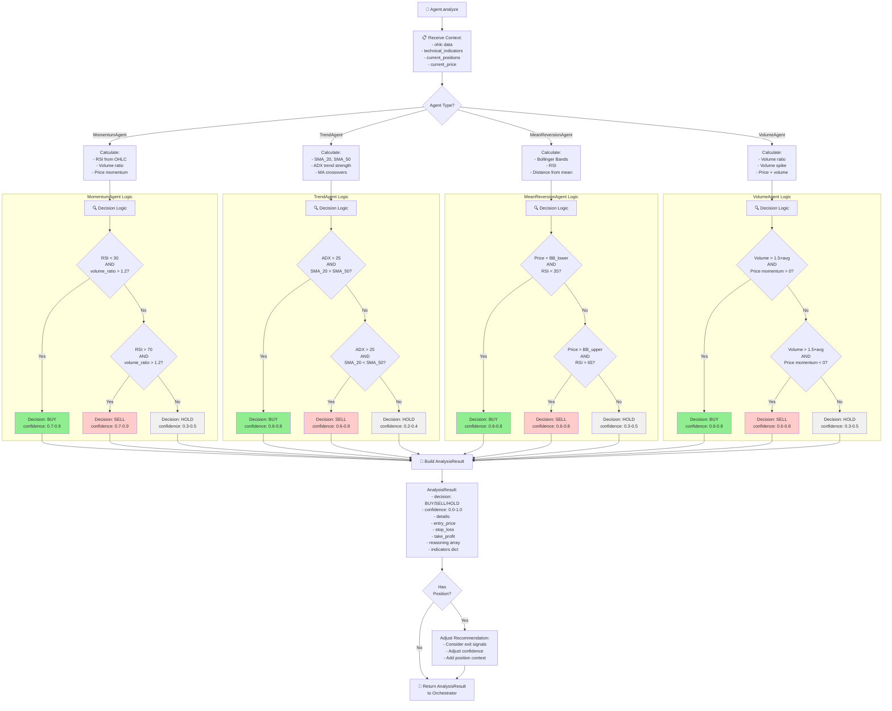

# Engine Module - Signal Flow Visualization

## 🔄 Complete Signal Generation Flow

```mermaid
flowchart TD
    Start[⏰ Every 15 Minutes] --> MarketCheck{Market Open?<br/>9:15-15:30 IST}
    MarketCheck -->|No| Wait[⏸️ Wait 5 Minutes]
    Wait --> Start
    MarketCheck -->|Yes| Orchestrator[🎯 EnhancedTradingOrchestrator]
    
    Orchestrator --> FetchData[📊 Fetch Market Data]
    FetchData --> OHLC[Get OHLC 100 bars<br/>from Redis]
    FetchData --> Indicators[Get Technical Indicators<br/>RSI, MACD, ADX, ATR]
    FetchData --> Positions[Get Current Positions<br/>from PositionManager]
    
    OHLC --> Context[📋 Build Analysis Context]
    Indicators --> Context
    Positions --> Context
    
    Context --> Agents[🤖 Run 4 Agents in Parallel]
    
    Agents --> Agent1[💨 MomentumAgent<br/>RSI + Volume Analysis]
    Agents --> Agent2[📈 TrendAgent<br/>MA Crossovers + ADX]
    Agents --> Agent3[🔄 MeanReversionAgent<br/>Bollinger Bands + RSI]
    Agents --> Agent4[📊 VolumeAgent<br/>Volume Spike Detection]
    
    Agent1 --> Result1[AnalysisResult:<br/>BUY/SELL/HOLD<br/>confidence: 0.0-1.0]
    Agent2 --> Result2[AnalysisResult:<br/>BUY/SELL/HOLD<br/>confidence: 0.0-1.0]
    Agent3 --> Result3[AnalysisResult:<br/>BUY/SELL/HOLD<br/>confidence: 0.0-1.0]
    Agent4 --> Result4[AnalysisResult:<br/>BUY/SELL/HOLD<br/>confidence: 0.0-1.0]
    
    Result1 --> Aggregate[🗳️ Aggregate Signals]
    Result2 --> Aggregate
    Result3 --> Aggregate
    Result4 --> Aggregate
    
    Aggregate --> Consensus{Consensus Check<br/>≥2 agents agree?<br/>confidence ≥0.6?}
    
    Consensus -->|No| Hold1[❌ Decision: HOLD<br/>No signal created]
    Consensus -->|Yes| CheckPositions{Position Check<br/>At limit?<br/>default: 3}
    
    CheckPositions -->|Yes, at limit| ExitOnly{Exit signals only?}
    ExitOnly -->|No| Hold2[❌ Decision: HOLD<br/>Position limit reached]
    ExitOnly -->|Yes| TradingDecision
    
    CheckPositions -->|No, below limit| TradingDecision[📝 Create TradingDecision<br/>BUY/SELL + entry/stop/target]
    
    TradingDecision --> LLMCheck{LLM Client<br/>Available?}
    
    LLMCheck -->|No| DirectSignal[Create signals<br/>from agent decision]
    LLMCheck -->|Yes| LLMDecision[🧠 Generate LLM Decision<br/>Final reasoning + strategy]
    
    LLMDecision --> LLMResult{LLM Decision<br/>HOLD or ERROR?}
    
    LLMResult -->|Yes| Hold3[❌ No signal created<br/>LLM override HOLD]
    LLMResult -->|No| CreateSignals[✅ _create_signals_from_decision]
    
    DirectSignal --> CreateSignals
    
    CreateSignals --> SignalCreator[🏭 SignalCreator.create_signals_from_decision]
    
    SignalCreator --> ParseReasoning[🔍 Parse Reasoning Text<br/>Extract conditions]
    
    ParseReasoning --> Conditions{Conditions<br/>Found?}
    
    Conditions -->|No| DefaultCondition[Create Default Condition:<br/>current_price > 0.99×current<br/>execution_mode: IMMEDIATE]
    Conditions -->|Yes| ExtractedConditions[Extracted Conditions:<br/>e.g., RSI > 32, price > 45000<br/>execution_mode: CONDITIONAL]
    
    DefaultCondition --> BuildSignal
    ExtractedConditions --> BuildSignal
    
    BuildSignal[🔨 Build TradingCondition Object]
    
    BuildSignal --> SignalObject[TradingCondition:<br/>- condition_id<br/>- instrument<br/>- indicator<br/>- operator<br/>- threshold<br/>- action BUY/SELL<br/>- position_size<br/>- stop_loss<br/>- take_profit]
    
    SignalObject --> Dedupe{Check Deduplication<br/>Similar signal<br/>in last 30 min?}
    
    Dedupe -->|Yes| SkipDuplicate[⏭️ Skip duplicate signal<br/>Return existing ID]
    Dedupe -->|No| SaveMongoDB[💾 Save to MongoDB<br/>signals collection<br/>status: pending]
    
    SaveMongoDB --> PublishRedis[📡 Publish to Redis<br/>engine:signal<br/>engine:signal:BANKNIFTY]
    
    PublishRedis --> SyncMonitor[🔄 Sync to SignalMonitor<br/>Add to active_signals]
    
    SkipDuplicate --> End1[🏁 Cycle Complete]
    Hold1 --> End1
    Hold2 --> End1
    Hold3 --> End1
    SyncMonitor --> End1
    
    End1 --> Wait15[⏰ Wait 15 Minutes]
    Wait15 --> Start
    
    style Start fill:#e1f5e1
    style Hold1 fill:#ffe1e1
    style Hold2 fill:#ffe1e1
    style Hold3 fill:#ffe1e1
    style CreateSignals fill:#90EE90
    style SaveMongoDB fill:#90EE90
    style PublishRedis fill:#90EE90
    style SyncMonitor fill:#90EE90
```



---

## 🎯 Real-Time Signal Monitoring Flow

```mermaid
flowchart TD
    TickStart[📊 Market Tick Arrives] --> LTPCollector[LTP Collector<br/>WebSocket Handler]
    
    LTPCollector --> StoreRedis[💾 Store in Redis<br/>market:tick:BANKNIFTY]
    StoreRedis --> PublishTick[📡 Publish Tick<br/>Redis pub/sub]
    
    PublishTick --> TechService[🔧 TechnicalIndicatorsService<br/>update_tick]
    
    TechService --> UpdateOHLC[Update OHLC Buffer<br/>1-min candles]
    TechService --> CalcIndicators[Calculate Indicators:<br/>- RSI_14<br/>- MACD<br/>- ADX_14<br/>- ATR<br/>- Bollinger Bands]
    
    CalcIndicators --> StoreIndicators[💾 Store Indicators<br/>Redis: indicators:BANKNIFTY]
    
    StoreIndicators --> PublishIndicators[📡 Publish Indicators<br/>Redis: indicators:BANKNIFTY]
    
    PublishIndicators --> RealtimeProcessor[⚡ RealtimeSignalProcessor<br/>Redis Listener]
    
    RealtimeProcessor --> SignalMonitor[🔍 SignalMonitor<br/>check_signals]
    
    SignalMonitor --> GetActive[Get Active Signals<br/>for BANKNIFTY]
    
    GetActive --> CheckLoop{For each<br/>active signal}
    
    CheckLoop --> CheckExpiry{Signal<br/>Expired?}
    
    CheckExpiry -->|Yes| MarkExpired[❌ Mark Expired<br/>Remove from monitor]
    CheckExpiry -->|No| EvaluateCondition[🧮 Evaluate Condition]
    
    EvaluateCondition --> GetIndicator[Get Indicator Value<br/>e.g., indicators.rsi_14]
    
    GetIndicator --> Compare{Compare:<br/>current_value<br/>vs threshold<br/>using operator}
    
    Compare -->|GREATER_THAN| GT[current > threshold?]
    Compare -->|LESS_THAN| LT[current < threshold?]
    Compare -->|CROSSES_ABOVE| CA[prev ≤ threshold<br/>AND current > threshold?]
    Compare -->|CROSSES_BELOW| CB[prev ≥ threshold<br/>AND current < threshold?]
    
    GT --> ConditionMet{Condition<br/>Met?}
    LT --> ConditionMet
    CA --> UpdatePrev1[Update Previous Value<br/>Redis: indicators_prev:*]
    CB --> UpdatePrev2[Update Previous Value<br/>Redis: indicators_prev:*]
    UpdatePrev1 --> ConditionMet
    UpdatePrev2 --> ConditionMet
    
    ConditionMet -->|No| NextSignal[Next Signal]
    ConditionMet -->|Yes| CheckAdditional{Additional<br/>Conditions<br/>AND logic?}
    
    CheckAdditional -->|No additional| CreateEvent
    CheckAdditional -->|Has additional| EvaluateAll[Evaluate All<br/>Additional Conditions]
    
    EvaluateAll --> AllMet{All<br/>Conditions<br/>Met?}
    
    AllMet -->|No| NextSignal
    AllMet -->|Yes| CreateEvent[🔔 Create SignalTriggerEvent]
    
    CreateEvent --> EventData[Event Data:<br/>- condition_id<br/>- instrument<br/>- action BUY/SELL<br/>- indicator_value<br/>- current_price<br/>- position_size<br/>- stop_loss<br/>- take_profit]
    
    EventData --> MarkTriggered[✅ Mark Signal Triggered<br/>is_active = False]
    
    MarkTriggered --> UpdateDB[💾 Update MongoDB<br/>status: triggered]
    UpdateDB --> PublishUpdate[📡 Publish Update<br/>Redis: engine:signal]
    
    PublishUpdate --> ExecuteCallback{Execution<br/>Callback<br/>Registered?}
    
    ExecuteCallback -->|No| LogOnly[📝 Log Trigger<br/>No execution]
    ExecuteCallback -->|Yes| ExecuteTrade[⚡ Execute Trade<br/>via callback]
    
    ExecuteTrade --> ExecutionAgent[🎯 ExecutionAgent<br/>validate_and_execute]
    
    ExecutionAgent --> PlaceOrder[📞 Place Order<br/>Broker API / Paper Trading]
    
    PlaceOrder --> RecordPosition[📝 Record Position<br/>PositionManager]
    
    RecordPosition --> FinalUpdate[💾 Final Update<br/>status: executed]
    
    LogOnly --> NextSignal
    FinalUpdate --> NextSignal
    
    NextSignal --> CheckLoop
    
    MarkExpired --> NextSignal
    
    style TickStart fill:#e1f5e1
    style CreateEvent fill:#fff4e1
    style ExecuteTrade fill:#90EE90
    style PlaceOrder fill:#90EE90
    style RecordPosition fill:#90EE90
```



---

## 🤖 Agent Decision Flow (Individual Agent)



---

## 📊 Current System State Analysis

### **What's WORKING (from logs):**

```
✅ Market Data Collection:
   - LTP ticks: 59571.65, 59568.30, 59573.65
   - Frequency: ~2 seconds

✅ Technical Indicators:
   - RSI_14: 52.14 (neutral)
   - MACD: 598.55, Signal: -267.82
   - ADX_14: 4.36 (weak trend)
   - ATR_14: 1341.20
   - Updating every tick (~2 seconds)

✅ Redis Pub/Sub:
   - Channel: market:tick:BANKNIFTY (working)
   - Channel: indicators:BANKNIFTY (working)
   - WebSocket gateway forwarding (working)
```

### **What's NOT HAPPENING (likely):**

```
❓ Orchestrator Cycles:
   - Expected: Every 15 minutes during market hours
   - Need to verify: Logs for "Running automatic orchestrator cycle"

❓ Agent Analysis:
   - Expected: 4 agents run in parallel
   - Current market conditions: ALL agents likely returning HOLD
     * RSI 52.14 → Not oversold/overbought
     * ADX 4.36 → Too weak for trend following
     * No volume spikes detected
     * Price range-bound (59568-59584)

❓ Signal Creation:
   - If agents return HOLD → No signals created (correct behavior)
   - If LLM returns HOLD → No signals created (correct behavior)
   - Check MongoDB for any signals: likely EMPTY or old signals only
```

### **Decision Tree for Current Market (RSI 52.14, ADX 4.36):**

```
Orchestrator Cycle Runs
   ↓
Agent Analysis:
   ↓
   ├─ MomentumAgent: RSI 52.14 (not < 30 or > 70) → HOLD (confidence 0.3)
   ├─ TrendAgent: ADX 4.36 (not > 25) → HOLD (confidence 0.2)
   ├─ MeanReversionAgent: Price not at BB extremes → HOLD (confidence 0.4)
   └─ VolumeAgent: No volume spike → HOLD (confidence 0.3)
   ↓
Aggregation:
   - HOLD signals: 4/4 (100%)
   - Average confidence: 0.30
   ↓
Consensus Check:
   - BUY signals: 0 (need ≥2)
   - SELL signals: 0 (need ≥2)
   ↓
Result: HOLD Decision
   ↓
❌ NO SIGNAL CREATED (correct behavior)
```

---

## 🎯 When WILL Signals Be Generated?

### **Scenario 1: Strong Momentum Signal**
```
Market Conditions:
   - RSI drops to 28 (oversold)
   - Volume spikes to 1.8x average
   - Price at support level

Agent Responses:
   - MomentumAgent: BUY (confidence 0.85) ✅
   - VolumeAgent: BUY (confidence 0.80) ✅
   - TrendAgent: HOLD (confidence 0.40)
   - MeanReversionAgent: BUY (confidence 0.70) ✅

Aggregation:
   - BUY signals: 3/4 (75%)
   - Average confidence: 0.78

Result: ✅ BUY SIGNAL CREATED
   - Condition: current_price > 59400 (immediate)
   - Position size: 1.5 (based on confidence)
   - Stop loss: 59200
   - Take profit: 59800
```

### **Scenario 2: Strong Trend Signal**
```
Market Conditions:
   - ADX strengthens to 32
   - SMA_20 crosses above SMA_50
   - Price breaks resistance

Agent Responses:
   - TrendAgent: BUY (confidence 0.75) ✅
   - MomentumAgent: BUY (confidence 0.65) ✅
   - VolumeAgent: BUY (confidence 0.70) ✅
   - MeanReversionAgent: HOLD (confidence 0.35)

Aggregation:
   - BUY signals: 3/4 (75%)
   - Average confidence: 0.70

Result: ✅ BUY SIGNAL CREATED
   - Condition: SMA_20 > SMA_50 (conditional)
   - Position size: 1.5
   - Stop loss: Below SMA_20
   - Take profit: 1.5× risk
```

---

## 🔍 Debug Checklist

To verify each component:

### **1. Orchestrator Running?**
```bash
# Check if automatic cycles are running
curl http://localhost:8006/api/v1/debug/orchestrator-state

# Expected:
{
  "orchestrator_initialized": true,
  "cycle_count": 47,  # Should increase every 15 min
  "last_cycle_time": "2026-01-14T15:00:00+05:30"
}
```

### **2. Agents Returning Decisions?**
```bash
# Trigger manual cycle
curl -X POST http://localhost:8006/api/v1/analyze \
  -H "Content-Type: application/json" \
  -d '{"instrument": "BANKNIFTY", "context": {"market_hours": true}}'

# Expected:
{
  "decision": "HOLD",  # Or BUY/SELL if conditions met
  "confidence": 0.30,
  "details": {
    "agent_signals": {
      "momentum": {"decision": "HOLD", "confidence": 0.3},
      "trend": {"decision": "HOLD", "confidence": 0.2},
      ...
    }
  }
}
```

### **3. Signals in MongoDB?**
```javascript
// Check MongoDB
db.signals.find({
  instrument: "BANKNIFTY",
  status: "pending",
  is_active: true
}).sort({created_at: -1}).limit(5)

// Expected (if signals created):
{
  condition_id: "BANKNIFTY_BUY_abc123_1704000000",
  action: "BUY",
  indicator: "current_price",
  threshold: 59400.0,
  status: "pending",
  created_at: "2026-01-14T15:00:00"
}
```

### **4. SignalMonitor Active?**
```bash
# Check active signals being monitored
curl http://localhost:8006/api/v1/signals/BANKNIFTY?status=pending

# Expected (if signals exist):
[
  {
    "signal_id": "65a1b2c3d4e5f6...",
    "instrument": "BANKNIFTY",
    "action": "BUY",
    "indicator": "rsi_14",
    "threshold": 32.0,
    "status": "pending"
  }
]
```

---

**Generated:** 2026-01-14 15:15:00 IST  
**Purpose:** Visual reference for understanding signal flow and agent orchestration  
**Version:** 1.0
